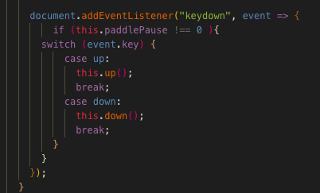
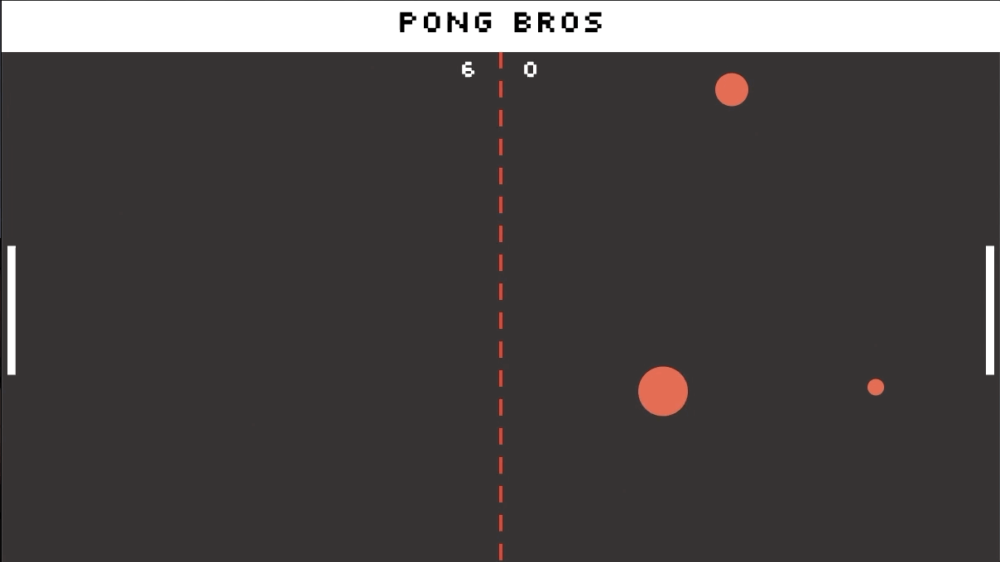
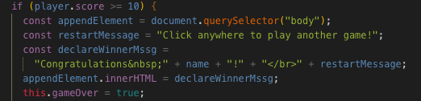
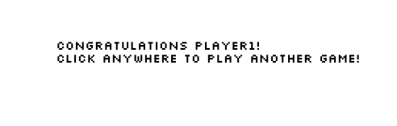
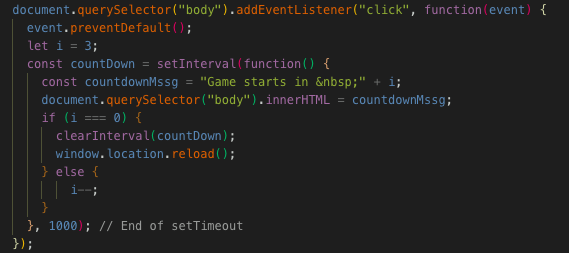

# Pong Game

A basic pong game using SVGs.

## Setup

**Install dependencies:**

`> npm i`

**Run locally with Webpack Dev Server:**

`> npm start`

**Build for production:**

`> npm run build`

## Keys

**Player 1:**
* a: up
* z: down

**Player 2:**
* ▲ : up
* ▼: down

## Game.js

methods: triggerBall(), render()

- includes a class "Game".
- renders all other svg from javacscript files (ball.js, paddle.js, board.js, score.js)

## Ball.js

methods: wallCollision(), paddleCollision(), goal(), render()

- called 2 let variables for both balls "circle" and "ballTwo"
- reset() consists of 3 important math functions to let the ball travel in random directions (Math.Abs, Math.random, Math.floor)
- set if else statements under wallCollision() to give vx and vy properties the opposite direction.

## Board.js 

methods: render()

- two let variables that forms the board
- appendChild() to bridge the svg to variable

## Paddle.js

methods: up(), down(), coordinates(), render().
- up and down functions used with math functions such as Math.min and Math.max

## Score.js

methods: render()

- called a let variable "text" 
- used appendChild() to link the text of the score to svg

## Stretch Goals

- under Ball.js, I used an if statement to declare the winner and as the winner is declared, an message would be appended to the document.querySelector('body').
- this is what it looks like on Visual Studio Code

- and this is what it looks like on the browser

- another stretch goal that I've challenged myself to create was a countdown that would render when a player clicks on the screen to play another game. I've managed to make that happen by using a setInterval() method inside of the on click event listener

- and this is what it looks like on the front end as the player clicks the screen.
